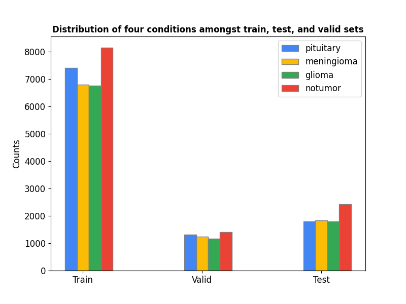
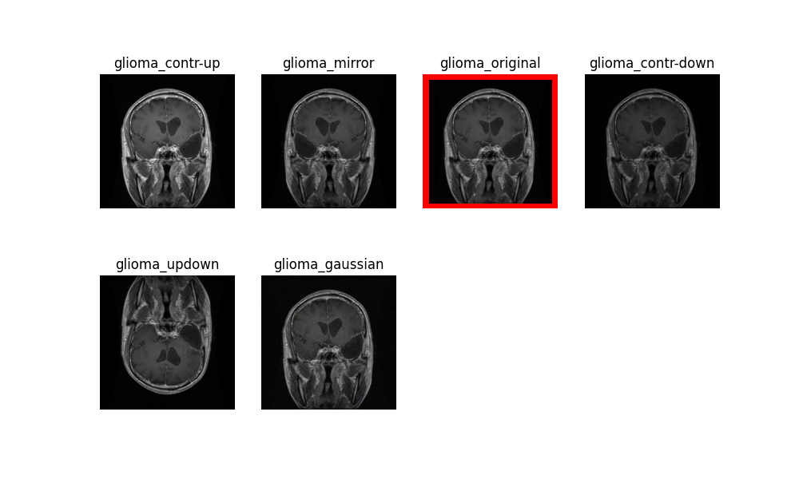
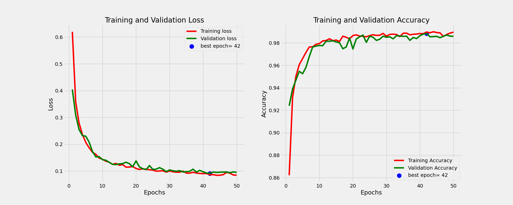

# brain_tumor_classifier

### Setup your environment

```terminal
cd ~/git_repos
git clone https://github.com/IoannisKaragiannis/brain_tumor_classifier.git

cd brain_tumor_classifier
chmod +x setup_env.sh
chmod +x remove_env.sh

./setup_env.sh

source ~/python_venv/brain/bin/activate
```

### Download dataset
Download the dataset from [here](https://www.kaggle.com/datasets/masoudnickparvar/brain-tumor-mri-dataset) and extract them inside this repo under the name `brain_tumor_mri_dataset`.

### Data Exploration

Perform data exploration 

```terminal
(brain)$ python3 src/data_exploration.py
```

The results will be stored under the `report/img` directory.

Below you can see an example of some random training data:


We can also observe that the training data are quite balanced 


Below one can observe that the distribution of the four different classes, namely `glioma`, `meningioma`, `notumor`, and `pituitary` is balanced among the training, validation and test data.



### Data Augmentation

1. Download the MRI data from [here](https://www.kaggle.com/datasets/masoudnickparvar/brain-tumor-mri-dataset).

2. Unzip the file and copy it in the root directory of the current repo under the name `brain_tumor_mri_dataset`

3. Rename the subdirectories into `train` and `test` accordingly.

4. The data have different dimensions. For convenience while performing data augmentation I also resize them to 256x256.

5. To perform data augmentation do the following. You can add more augmentation techniques but be cautious when it comes to MRI dataset. If the distribution of the augmented dataset diverges significantly then the model will learn erroneously.

   ```terminal
   # augment train data
   (brain)$ python3 src/augment_data.py --data train
   
   # augment test data
   (brain)$ python3 src/augment_data.py --data test
   ```
   
   It will take a while. Next to the `train` and `test` folders, a new directory called `train_augmented` or `test_augmented`will be created accordingly. Only the training data or their augmented version will be used throughout the training process while the test data will be left untouched for evaluation purposes. An example of the different augmentation techniques applied on one particular glioma sample:




### Test a model

```terminal
# test single image (modify the test_sample and test_label in the config.ini)
(brain)$ python3 src/test_single_mri.py

# test single image with GUI
(brain)$ python3 src/diagnose_with_gui.py

# evaluate model on test-set
(brain)$ python3 src/test.py
```

# RESULTS

Below you will find the performance of 4 different models, with and without data augmentation.

## ResNet50

```ini
[General]
mri_data_path=brain_tumor_mri_dataset
augmentation=False
num_classes=4

[Training]
train_batch_size=32
test_size=0.2
epochs=50
learning_rate=0.0001
input_size=224
model_name=ResNet50
num_unfrozen_layers=9
# allowed values: {tiny, large, VGG16, ResNet50, EfficientNetB{0,1,7}, MobileNetv2, Inceptionv3, Xception
model_type=ResNet50

[Testing]
test_batch_size=16
```


classification report

```terminal
Test Loss: 0.3312033712863922
Test Accuracy: 0.8996913433074951
Predicting for 1296 samples
81/81 [==============================] - 121s 1s/step
QSocketNotifier: Can only be used with threads started with QThread
Classification Report:
              precision    recall  f1-score   support

      glioma       0.93      0.73      0.82       296
  meningioma       0.76      0.88      0.82       302
     notumor       0.96      0.99      0.97       402
   pituitary       0.96      0.97      0.96       296

    accuracy                           0.90      1296
   macro avg       0.90      0.89      0.89      1296
weighted avg       0.91      0.90      0.90      1296
```

confusion matrix


## ResNet50-aug

```ini
[General]
mri_data_path=brain_tumor_mri_dataset
augmentation=True
num_classes=4

[Training]
train_batch_size=64
test_size=0.15
epochs=50
learning_rate=0.0001
input_size=224
model_name=ResNet50_aug
num_unfrozen_layers=15
# allowed values: {tiny, large, VGG16, ResNet50, EfficientNetB{0,1,7}, MobileNetv2, Inceptionv3, Xception
model_type=ResNet50

[Testing]
test_batch_size=16
```


classification report

```terminal
Test Loss: 0.3191703259944916
Test Accuracy: 0.9158604741096497
Predicting for 7856 samples
491/491 [==============================] - 709s 1s/step
QSocketNotifier: Can only be used with threads started with QThread
Classification Report:
              precision    recall  f1-score   support

      glioma       0.90      0.84      0.87      1797
  meningioma       0.84      0.83      0.83      1836
     notumor       0.95      0.99      0.97      2428
   pituitary       0.97      0.98      0.97      1795

    accuracy                           0.92      7856
   macro avg       0.91      0.91      0.91      7856
weighted avg       0.91      0.92      0.92      7856
```

confusion matrix


## VGG16

```ini
[General]
mri_data_path=brain_tumor_mri_dataset
augmentation=False
num_classes=4

[Training]
train_batch_size=32
test_size=0.2
epochs=50
learning_rate=0.0001
input_size=224
model_name=VGG16
num_unfrozen_layers=4
# allowed values: {tiny, large, VGG16, ResNet50, EfficientNetB{0,1,7}, MobileNetv2, Inceptionv3, Xception
model_type=VGG16

[Testing]
test_batch_size=16
```


classification report

```terminal
Test Loss: 0.20448878407478333
Test Accuracy: 0.9506173133850098
Predicting for 1296 samples
81/81 [==============================] - 2s 24ms/step
Classification Report:
              precision    recall  f1-score   support

      glioma       0.93      0.92      0.93       296
  meningioma       0.91      0.88      0.89       304
     notumor       0.99      1.00      0.99       401
   pituitary       0.96      0.99      0.97       295

    accuracy                           0.95      1296
   macro avg       0.95      0.95      0.95      1296
weighted avg       0.95      0.95      0.95      1296
```

confusion matrix


## VGG16-aug

```ini
[General]
mri_data_path=brain_tumor_mri_dataset
augmentation=True
num_classes=4

[Training]
train_batch_size=64
test_size=0.15
epochs=50
learning_rate=0.0001
input_size=224
model_name=VGG16_aug
num_unfrozen_layers=8
# allowed values: {tiny, large, VGG16, ResNet50, EfficientNetB{0,1,7}, MobileNetv2, Inceptionv3, Xception
model_type=VGG16

[Testing]
test_batch_size=16
```

It is worth mentioning that throughout the training process, when splitting the training and validation data I maintained the proportion of classes in both the training and validation datasets (having the same class distribution) by using the `stratify` variable. This is what the `train` and `valid` data look like.


And this is the learning curves. For more information on how I perform the training please consult the `train` function of `Classifier` class in the `utils.py` script.



classification report

```terminal
Test Loss: 0.118095263838768
Test Accuracy: 0.976578414440155
Predicting for 7856 samples
491/491 [==============================] - 10s 20ms/step
Classification Report:
              precision    recall  f1-score   support

      glioma       0.97      0.95      0.96      1797
  meningioma       0.96      0.96      0.96      1834
     notumor       1.00      1.00      1.00      2428
   pituitary       0.98      1.00      0.99      1797

    accuracy                           0.98      7856
   macro avg       0.98      0.97      0.97      7856
weighted avg       0.98      0.98      0.98      7856
```

confusion matrix


#### Conclusion

VGG16 with the particular data augmentation seems to be promising even when we augment with slightly different way the test data. However, one should bear in mind that even the distribution of the test data of this particular MRI dataset taken from [Kaggle](https://www.kaggle.com/datasets/masoudnickparvar/brain-tumor-mri-dataset) is close enough to the distribution of the train data. This does not seem to be the case for images taken from the internet. My classifier, even the VGG16-based one, will most likely misclassify the unseen MRI images fetched from the internet. At this point I want to admit that due to lack of medical knowledge or expertise I am in no position to evaluate the quality of the training data themselves. 

### GUI

```terminal
(brain)$ python3 src/diagnose_with_gui.py
```


<video width="640" height="360" controls>
  <source src="report/videos/gui_demo.webm" type="video/webm">
  Your browser does not support the video tag.
</video>


[](report/videos/gui_demo.webm)